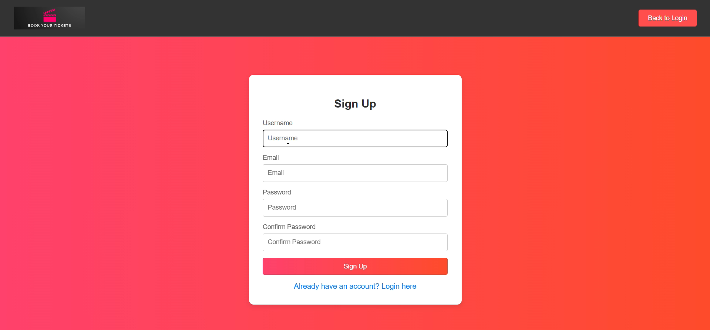
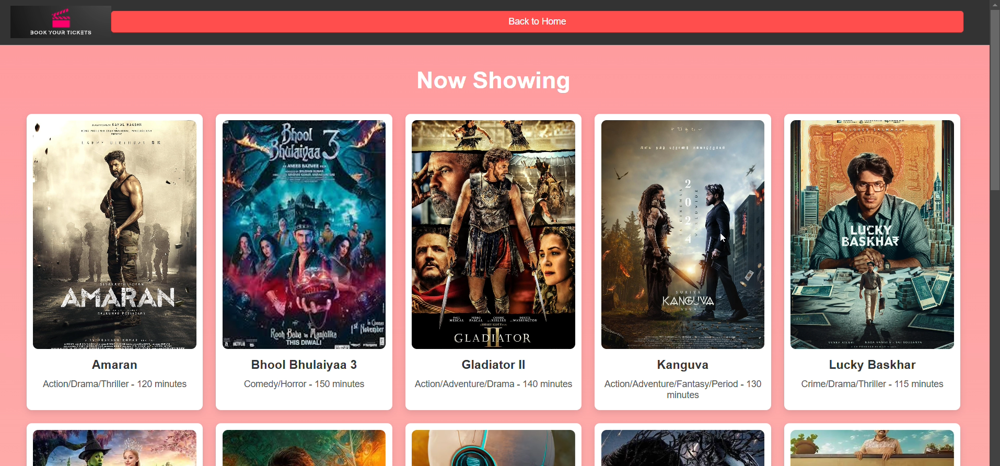
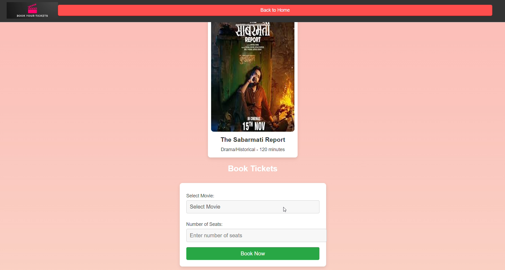
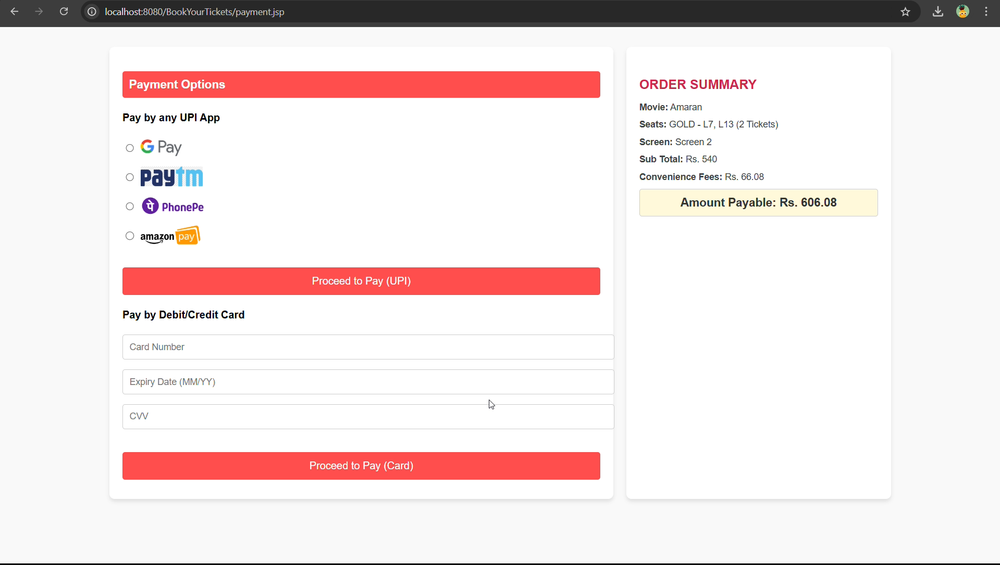
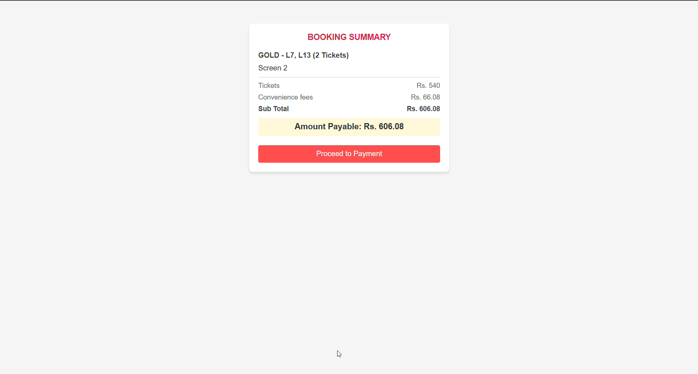
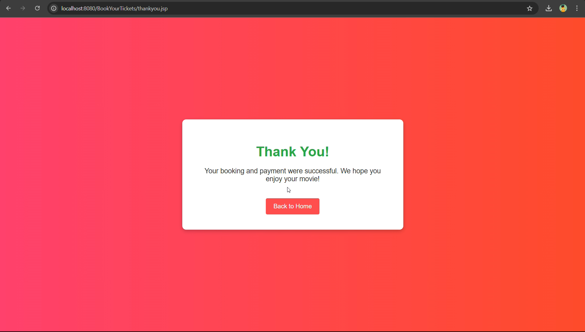

# BookYourTickets

A simple ticket booking system built with **Java** and **SQLite**.  
This project demonstrates basic user management, booking workflows, and database connectivity using JDBC.

## Features
- User registration and login  
- Book and cancel tickets  
- View booking history  

## Tech Stack
- Java (JDK 8 or higher)  
- SQLite  
- JDBC  

## Getting Started
1. Clone the repository:
   ```bash
   git clone https://github.com/Preetham0420/BookYourTickets.git
2. Open the project in IntelliJ IDEA (or your preferred IDE).  
3. Run `Main.java` to start the application.  

## Project Structure
- `src/` → Java source files  
- `src/assets/` → Screenshots and images  
- `localdb.db` → SQLite database file  
- `README.md` → Project documentation  

## Screenshots

### Login Page


### Signup Page


### Available Movies


### Booking Page


### Booking Confirmation


### Booking Summary


### Payment Page


## Author
Preetham Elakurthy ([GitHub](https://github.com/Preetham0420))

